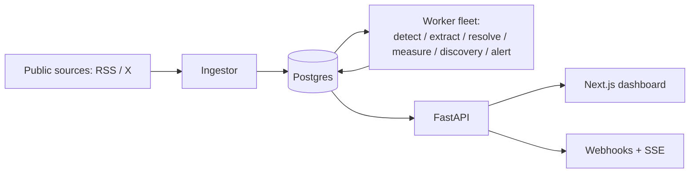

# bellwether

A single-user research system that ingests public statements of high-influence figures, extracts structured market signals with LLMs (DSPy), and measures their real market impact.

## What & why

Some public figures move markets when they speak; most don't. Bellwether tries to answer, systematically, *which* figures actually move markets and *whether* a given statement did — by ingesting what they publicly say, extracting a structured signal, resolving it to a tradeable entity, and measuring the real price move afterward. It is deliberately bounded: **read-only, provenance-guarded, no trading, no content generation, no execution.** It never places an order and never invents evidence — every extracted claim is checked against the source text.

## System diagram



## Feature tour

- **The pipeline** — detect market-relevance in a raw statement, extract a structured signal, resolve the named entity to a market symbol, then measure the price move around the statement via an event study.
- **Source discovery** — new sources for a watched figure are proposed from Wikidata plus an LLM (with Tavily gap-fill), then passed through a deterministic confidence gate before ever going live.
- **Evaluation & optimization flywheel** — reviewers correct model output into golden labels, GEPA optimizes prompts against them, and a champion/challenger process promotes a new program only if it's strictly better on held-out data — all behind a market-accuracy firewall (scoring never touches market data).
- **Alerts** — per-rule webhooks fire on new extractions, plus a live SSE feed for the dashboard.
- **Dashboard** — a Next.js app over the same API, for reviewing signals, impacts, and a per-figure leaderboard.

## Quickstart (Docker)

```bash
cp .env.docker.example .env      # edit JWT_SECRET / ADMIN_PASSWORD
docker compose up --build        # Postgres + migrations + API (:8000) + 6 workers + frontend (:3000)
# open http://localhost:3000
```

For host development (venv, running individual pieces), see **[docs/DEVELOPING.md](docs/DEVELOPING.md)**.

## Surface at a glance

The REST API is self-documented — run the API and open **`/docs`** (Swagger) or fetch **`/openapi.json`**.

| Group | Endpoints |
|---|---|
| Auth | `POST /auth/token`, `GET /me` |
| Watchlist | `GET/POST /figures`, `DELETE /figures/{id}`, `POST /figures/{id}/discover`, `GET/POST /figures/{id}/sources`, `PATCH/DELETE /sources/{id}` |
| Statements | `GET /statements` |
| Discovery | `GET /discovery/queue`, `POST /discovery/{source_id}` |
| Review | `GET /review/queue`, `POST /review/{statement_id}` |
| Feed | `GET /signals`, `GET /impacts`, `GET /leaderboard` |
| Alerts | `GET/POST /alert_rules`, `PATCH/DELETE /alert_rules/{rule_id}` |
| Live | `GET /stream` (SSE) |

Workers and optimization run as separate CLIs:

```bash
python -m bellwether.worker {detect|extract|resolve|measure|discovery|alert}
python -m bellwether.optimize {run|programs|promote|evals}
```

## Project layout

```
src/bellwether/
├── api/          # FastAPI routers: auth, watchlist, statements, discovery, review, feed, alert_rules, stream
├── worker.py     # generic Stage runner + CLI (the 6 worker stages)
├── queue.py      # claim-then-commit queue primitives (FOR UPDATE SKIP LOCKED)
├── models/       # SQLAlchemy models -- the 15 tables
├── connectors/   # source connectors (rss, x) + registry
├── ingest.py     # ingest pass: pull sources -> new statements
├── llm/          # DSPy modules: detect, extract, resolve (+ contracts, guard)
├── market/       # market data adapter (yfinance) + event-study measurement inputs
├── measure/      # impact measurement (event study over resolved symbols)
├── eval/         # Track A: golden labels, GEPA optimization, evaluation (market-firewalled)
├── trackb/       # Track B: market-impact reporting (leaderboard)
├── optimize.py   # optimize CLI (run/programs/promote/evals)
├── programs.py   # champion/challenger dspy_programs management
├── discovery/    # source discovery: Wikidata backbone, DSPy disambiguation, confidence gate
├── alerts/       # alert rule engine + webhook notifier
├── security/     # JWT auth, password hashing, auth dependencies
└── config.py     # Settings (env-driven)

frontend/         # Next.js dashboard (generated OpenAPI client)
docs/             # architecture, data model, developing guides + specs/plans
```

## Status & how it was built

**Complete: Plans 1-7b + Dockerized.**

Bellwether was built as a 7-plan sequence (foundation, ingestion, LLM layer, resolve & measure, evaluation & optimization, discovery & alerts, dashboard), each plan spec-driven, then test-driven, then reviewed both per-task and across the whole branch, then verified end-to-end against a live stack before merging. The specs and plans live in `docs/superpowers/`.

## Documentation

- Architecture → [docs/ARCHITECTURE.md](docs/ARCHITECTURE.md)
- Data model → [docs/DATA-MODEL.md](docs/DATA-MODEL.md)
- Developing → [docs/DEVELOPING.md](docs/DEVELOPING.md)
- For AI agents → [AGENTS.md](AGENTS.md)
- Docker → [README-docker.md](README-docker.md)
