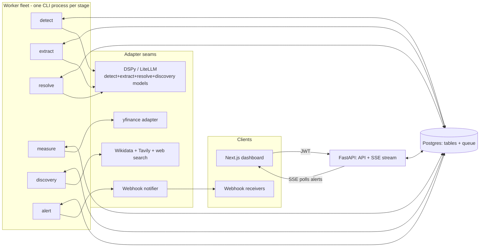
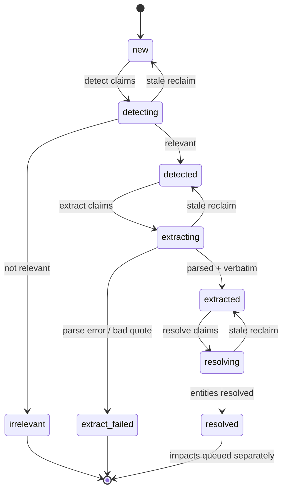

# bellwether — Architecture

Technical deep-dive for engineers working on the codebase. For the pitch and quickstart,
see the [README](../README.md); for the "why" behind these decisions, see the specs in
`docs/superpowers/specs/`.

## 1. Overview

Bellwether is a set of independent, restartable processes that share one Postgres
database as both the system of record and the job queue. Nothing talks to anything
else directly — a FastAPI process serves the API and dashboard, seven worker processes
each drive one pipeline stage, and Postgres is the only thing all of them touch. A
worker crashing, or being killed and restarted, loses at most the one row it had
claimed — a stale-reclaim sweep puts that row back in the queue.

Every stage that needs an external capability (LLM, market data, source discovery,
webhook delivery) gets it through a narrow adapter seam: a frozen dataclass/Protocol
contract plus a `build_*()` factory that decides, at process start, which concrete
implementation to hand back. The stage code itself never imports a vendor SDK.



## 2. The pipeline, stage by stage

Five stages carry a statement from raw text to a measured market move:
**Ingest → Detect → Extract → Resolve → Measure**. Each is a plain function (or a
worker `Stage`, see §3) operating on rows in Postgres; there is no in-process
hand-off between stages — a stage writes a status, and the next stage's `claim_next`
picks the row up whenever it next polls.

### 2.1 Ingest
- **Consumes:** enabled `sources` rows (`connector_type`, `config` JSON, poll interval).
- **Writes:** new `statements` rows (`status="new"`), deduped by `(source_id,
  external_id)`.
- **Logic:** `run_ingest_pass` (`src/bellwether/ingest.py`) iterates enabled sources,
  builds a connector via `build_connector(source)`, fetches, and inserts statements
  not already seen for that source. Each source is committed independently.
- **Errors:** per-source `try/except Exception` — one source's failure (network
  error, unknown connector type, parser exception) is logged and skipped; it does
  **not** abort the rest of the pass or roll back statements already committed for
  other sources in the same run. (This is a fixed bug — see §8.)

The `ingest` stage is a deliberate variant of the claim/reclaim pattern — it stamps
`last_polled_at` at claim time as both schedule clock and claim guard, so it needs no
in-flight status and no reclaim.

### 2.2 Detect
- **Consumes:** `statements` in `status="new"`.
- **Writes:** a `detections` row (`is_relevant`, `score`, `model`, `version`); sets
  `statement.status` to `"detected"` (score at/above `relevance_threshold`) or
  `"irrelevant"` otherwise.
- **Logic:** a DSPy classifier on a cheap/fast model (`build_detector()`), run on
  every ingested statement, gating the far more expensive Extract step.
- **Errors:** any exception (LLM/network) aborts the row's transaction — the row
  stays claimed (`status="detecting"`) until the periodic stale-reclaim resets it
  back to `"new"` for a retry. All Detect failures are **retryable**; there is no
  terminal Detect failure state.

### 2.3 Extract
- **Consumes:** `statements` in `status="detected"`.
- **Writes:** an `extractions` row (`entities`, `direction`, `magnitude`,
  `confidence`, `evidence_quote`, `model`, `version`); sets `statement.status` to
  `"extracted"` or `"extract_failed"`.
- **Logic:** the core DSPy module (`build_extractor()`) on the optimized model.
  Every `evidence_quote` is checked with `is_verbatim()` against the source text —
  the structural anti-fabrication guard.
- **Errors:** `ExtractionParseError` (model output doesn't parse into the contract)
  or a failed verbatim check both write `status="extract_failed"` — **terminal**,
  no retry, since re-running the same model on the same text won't change the
  outcome. Any other exception (LLM/network) is **retryable** via stale-reclaim,
  same as Detect.

### 2.4 Resolve
- **Consumes:** `statements` in `status="extracted"` (joined to their `extractions`
  row).
- **Writes:** a `resolutions` row per extracted entity (`symbol`, `asset_class`,
  `measurable`); for measurable entities, one `impacts` row per configured window
  (`status="pending"`, `due_at = published_at + window`); sets `statement.status`
  to `"resolved"`.
- **Logic:** entity → symbol via `build_resolver()` (LLM-backed, cached through
  `entity_symbols` so repeat mentions of the same entity skip the LLM call — a
  concurrent-insert race on that cache is absorbed with a `session.begin_nested()`
  savepoint, not a full stage retry). Unmappable entities are stored non-measurable
  and never get an `impacts` row.
- **Errors:** any exception is retryable — Resolve has no terminal failure state of
  its own (unmappable entities are a normal outcome, not an error).

### 2.5 Measure
- **Consumes:** `impacts` in `status="pending"` whose `due_at <= now()` — a
  **time-gated** queue, not a status-only one (see §3).
- **Writes:** `price_t0`, `price_after`, `pct_move`, `volume_spike`, `measured_at`;
  sets `impact.status` to `"measured"` or `"measure_failed"`.
- **Logic:** fetches a price series bracketing the event via the `MarketData`
  adapter (yfinance), computes the realized move at the configured window against
  a rolling baseline (`compute_impact`).
- **Errors:** insufficient free-data coverage for the series → `"measure_failed"`
  (**terminal** — more retries won't produce data that doesn't exist). A
  `MarketDataError` from the adapter (rate limit, transient fetch failure)
  propagates, rolls back, and is **retryable** via stale-reclaim.



The `impacts.status` sub-queue (`pending → measuring → measured/measure_failed`,
driven by `due_at`, not by `statements.status`) is intentionally a separate state
machine — see §3.

## 3. Worker & queue model

Every worker is a `python -m bellwether.worker {ingest|detect|extract|resolve|measure|discovery|alert}`
CLI process running `run_worker(stage)` in a loop, where `Stage` is one
generic dataclass:

```python
@dataclass
class Stage:
    name: str
    claim_next: Callable[[Session], object | None]
    reclaim: Callable[[Session, float], int]
    process: Callable[[Session, object], None]
```

`worker.py` has no per-stage special-casing in the run loop — `make_ingest_stage`,
`make_detect_stage`, `make_extract_stage`, `make_resolve_stage`, `make_measure_stage`,
`make_discovery_stage`, and `make_alert_stage` each just assemble a `Stage` from
this one shape.

**Claim-then-commit before slow work.** `claim_next` (`src/bellwether/queue.py`)
runs `SELECT ... FOR UPDATE SKIP LOCKED` scoped to the row's current status,
flips the status to an in-flight value (`"detecting"`, `"extracting"`,
`"resolving"`, `"measuring"`, discovery's `"running"`, alert's `"alerting"`), and
commits — *before* the LLM call, market fetch, or webhook POST happens. This is
what makes concurrent workers on the same stage safe: `FOR UPDATE SKIP LOCKED`
means two workers racing for the same row never both get it (one skips it and
grabs the next), and because the claim is committed immediately, a crash during
the slow part leaves the row visibly "in-flight" rather than silently
re-claimable by another worker.

**Graceful shutdown + periodic reclaim.** `SIGINT`/`SIGTERM` set a
`threading.Event`; the loop finishes whatever row it's mid-`process` on, then
exits (`--once` drains the queue and exits without waiting for signals — used for
CI/scripted runs). Separately, on a periodic interval (`worker_stale_reclaim_seconds`),
each stage's `reclaim()` resets rows that have sat in an in-flight status past a
cutoff back to their claimable status — this is the crash-recovery path: a worker
that died mid-`process` leaves a row stuck at `"detecting"`/etc., and reclaim is
what unsticks it for another worker to pick up.

**Four independent claim columns — so stages don't contend.** There is no single
global queue table; each stage claims off its own column, so a slow Measure fetch
never blocks Detect from claiming new statements, and running six workers
concurrently against the same tables never causes them to block each other on
locks meant for a different stage's rows:

| Column | Owning stages | Time-gated? |
|---|---|---|
| `statements.status` | detect, extract, resolve | no |
| `impacts.status` + `due_at` | measure | yes — `due_at <= now()` |
| `figures.discovery_status` | discovery | no |
| `extractions.alert_status` | alert | no |

Measure's queue is the odd one out: it isn't just a status filter, it's
`Impact.status == "pending" AND Impact.due_at <= now()` — an impact isn't
claimable until its event-study window has actually elapsed, which is the whole
point of measuring the *realized* move rather than an instantaneous one.

## 4. The seams

The system has exactly four places where a vendor/paradigm choice could leak into
stage logic, and each is closed off the same way: a **frozen contract** (a
`Protocol` plus frozen `dataclass` result types, in `*/contracts.py`) that the
stage code depends on, and a **`build_*()` factory** that resolves the contract to
a concrete implementation at process start.

- **`Detector` / `Extractor` / `Resolver`** (`src/bellwether/llm/contracts.py`) —
  `detect(text) -> DetectionResult`, `extract(text) -> ExtractionResult`,
  `resolve(entity, context) -> ResolutionOutcome`. `build_detector()`,
  `build_extractor()`, `build_resolver()` each construct a DSPy module, attach an
  LM via `make_lm(settings.<x>_model)`, and wrap it in a thin adapter that maps the
  DSPy `Prediction` onto the frozen result type. Swapping DSPy for a different
  paradigm entirely would mean rewriting these three factories and adapters —
  `make_detect_stage`/`make_extract_stage`/`make_resolve_stage` in `worker.py`
  wouldn't change at all, since they only see the `Detector`/`Extractor`/`Resolver`
  Protocol.
- **`Discoverer`** (`src/bellwether/discovery/contracts.py`) — `disambiguate()` /
  `gapfill()`, the same shape applied to the discovery pipeline (§6).
- **The champion-loading seam.** `_build_stage("detect"|"extract")` in `worker.py`
  calls `load_champion(session, module)` *before* calling `build_detector`/
  `build_extractor`, and — if a champion program row exists — passes its
  `artifact` as `program_state` and its `version` (stamped onto every `Detection`/
  `Extraction` row it produces, so results are always traceable to the program
  version that produced them). No champion yet → `build_*()` falls back to an
  un-optimized baseline module. This is how the optimization flywheel (§5) reaches
  production without the worker process knowing anything about GEPA or training.
- **Provider-agnostic LLM layer.** DSPy is the one and only LLM orchestration
  framework in the codebase, and it's model-agnostic via LiteLLM
  (`make_lm(model_name)` in `src/bellwether/llm/config.py` hands DSPy an LM string
  like `"openai/gpt-4o-mini"`; switching provider/model is a config change, not a
  code change).
- **Market / discovery / notifier adapter registries.** `build_market_data()`
  (`src/bellwether/market/registry.py`) currently always returns `YFinanceAdapter`
  behind the `MarketData` protocol — a future CoinGecko adapter for
  `asset_class="crypto"` slots in behind the same factory without touching
  `make_measure_stage`. `build_notifier()` similarly returns a `WebhookNotifier`
  behind the `Notifier` protocol used by the alert stage.

**A note on what "paradigm-free" actually means here.** `worker.py` is
*paradigm*-free — it never imports `dspy` or a vendor SDK, only the frozen
contracts — but it is **not** import-free of the DSPy-backed builders. It imports
`build_detector`, `build_extractor`, `build_resolver`, and `build_market_data` at
module top (these are needed for every worker process regardless of which stage
it runs, and pulling them in eagerly is cheap and keeps `_build_stage` simple).
The discovery-stage clients (`build_wikidata`, `build_web_search`,
`build_x_verifier`, `build_discoverer`, `build_http`) and the alert stage's
`build_notifier` **are** imported lazily, function-local inside
`_build_stage`, precisely because those pull in heavier/optional network deps
(Wikidata, Tavily/web-search, X verification, webhook delivery) that a `detect` or
`measure` worker process has no reason to load.

## 5. Evaluation & the firewall

Two tracks answer two different questions, and are structurally forbidden from
influencing each other.

**Track A — semantic accuracy** (`src/bellwether/eval/`) drives optimization:

1. **Golden labels as a review byproduct.** The review-and-correct UI turns
   reviewer decisions into `relevance_labels` and `extraction_labels` rows
   (`source="review"`), each tagged `split="train"` or `split="holdout"` up
   front, so a version's reported accuracy is always on data the optimizer never
   saw.
2. **GEPA optimize** (`src/bellwether/eval/optimize.py`, `gepa_metric.py`)
   compiles a challenger DSPy program against the train split.
3. **Champion/challenger promotion.** `optimize()` evaluates the challenger and
   the current champion on the *same* held-out split and calls
   `promote_if_better(challenger_holdout, champion_holdout)` — a strict `>`, so
   ties don't promote. Programs are versioned rows in `dspy_programs`
   (`save_program`/`set_champion` in `src/bellwether/programs.py`); promotion is
   `is_champion` flipping on one row and off all others for that module — instant
   rollback is just re-flipping it.
4. **Champion-loading seam** (§4) puts a promoted program into production the
   next time a detect/extract worker process starts.

**Track B — market-impact reporting** (`src/bellwether/trackb/report.py`) is
purely descriptive: `leaderboard_by_figure()` aggregates realized `impacts` per
figure (e.g. "figure X's statements move symbol Y by Z% within 1h") for the
dashboard. It never feeds back into optimization.

**The firewall.** Track A's scoring path (`eval/evaluate.py`, `eval/metrics.py`,
`eval/optimize.py`) is only ever given a statement, a label, and a model's output
— never a `Resolution` or `Impact` row. This is enforced two ways, both checked
by `tests/test_firewall.py`: a **static check**
(`test_eval_modules_do_not_reference_market_models`) asserts the source of those
three modules never mentions `Impact` or `Resolution` at all; a **behavioral
invariance check** (`test_track_a_score_is_invariant_to_market_data`) scores the
same extraction before and after injecting a measured `Impact` row for it and
asserts the score is unchanged. A faithful reading of a statement the market
ignored is still a correct read.

## 6. Source discovery

The `discovery` worker (`make_discovery_stage`, backed by
`src/bellwether/discovery/pipeline.py::run_discovery`) turns a figure name into
verified, enabled `sources` rows with no manual source-hunting required:

1. **Wikidata backbone (deterministic).** `wikidata.search()` + `wikidata.claims()`
   pull the official website (`P856`), X username (`P2002`), YouTube channel
   (`P2397`), and aliases for the matched entity.
2. **DSPy Discovery module (fuzzy parts).** `discoverer.disambiguate()` picks
   which Wikidata entity the name actually refers to (flagging low-confidence
   matches `ambiguous`); `discoverer.gapfill()` proposes additional candidate
   sources from `web_search` (Tavily) results when Wikidata doesn't have enough —
   these run even with zero Wikidata matches, so a figure with no Wikidata
   presence still gets a (necessarily low-confidence) discovery attempt rather
   than a dead end.
3. **The confidence gate — deterministic, additive.** `score_binding()`
   (`src/bellwether/discovery/verify.py`) sums fixed per-signal weights
   (`wikidata: 0.6`, `domain_match: 0.3`, `x_verified: 0.2`, `reachable: 0.2`,
   capped at `1.0`) and compares against `discovery_confidence_threshold`. A
   binding is auto-enabled only if it clears the threshold **and** the parent
   entity match wasn't itself ambiguous.
4. **Auto-enable vs. `pending_review`.** Bindings that pass the gate get
   `status="active"`, `enabled=True`, `verified=True`; everything else lands in
   `status="pending_review"` — a human decides (confirm → active, reject →
   rejected). Re-running discovery for a figure never overwrites a row a human
   has already decided on — only rows still `pending_review` get refreshed.
5. **The review queue** is what a human works from (`GET /discovery/queue`,
   `POST /discovery/{source_id}`); confirm/reject actions are also a byproduct
   label source that can optimize the Discovery module later, symmetric with
   Detect's relevance labels.

## 7. Alerts

The `alert` stage (`make_alert_stage`, `src/bellwether/alerts/engine.py`) is
deliberately decoupled from Extract: it claims off its own queue column
(`extractions.alert_status`, `"pending" → "alerting" → "done"`) rather than
running inline inside the extract stage, so a slow or failing webhook can never
back up extraction.

- **Evaluate rules.** For each new extraction, `evaluate_extraction()` loads the
  owning figure's enabled `alert_rules` and checks each against the extraction via
  `matches()` (condition on confidence/magnitude/direction/figure, etc.).
- **Write, then dispatch.** A matching rule writes an `alerts` row first (dedup on
  `(extraction_id, rule_id)` — re-processing never double-fires), then dispatches
  to the rule's webhook if one is configured (`WebhookNotifier`, Slack- and
  Discord-shaped payload sent together since each service ignores the other's
  key); `webhook_status` and `sent_at` record the outcome.
- **The dashboard feed and the webhook share one source of truth.** `GET /stream`
  (SSE, `src/bellwether/api/stream.py`) doesn't get pushed alerts from the worker
  process — it **polls** the `alerts` table on its own short-lived session, on an
  interval, filtered to the authenticated user's `owner_id` and rows newer than
  the last one it sent. This is what lets the API process and the worker fleet be
  entirely separate processes (potentially separate machines) without any direct
  channel between them — Postgres is the only thing connecting "an alert was
  written" to "the dashboard sees it."

## 8. Cross-cutting invariants

- **Read-only, provenance-always.** Connectors only fetch already-published
  content; nothing is synthesized. Every `statements` row carries a source `url`
  and a `provenance` level (`primary` vs `reported`).
- **The verbatim guard.** `is_verbatim(evidence_quote, statement.text)` is checked
  in Extract before an extraction is accepted (§2.3) — the structural
  anti-fabrication guarantee, not a prompt instruction the model could ignore.
- **Owner-scoping.** User-owned tables carry a nullable `owner_id`; queries filter
  on it throughout (e.g. the alert engine's rule lookup, the SSE stream's alert
  filter) so the single-user v1 model is already shaped for the deferred
  multi-user extension.
- **Idempotency.** Ingest dedups on `(source_id, external_id)`; the resolve
  stage's entity→symbol cache absorbs concurrent-insert races with a savepoint
  rather than failing the whole row; alert dispatch dedups on
  `(extraction_id, rule_id)` so a re-processed extraction can't refire the same
  alert.
- **Verify live — stubs hide integration bugs.** Three real bugs shipped past
  automated tests and per-task review, and were only caught by driving the actual
  system end-to-end:
  - **The fetch-window bug.** The stubbed market adapter used in tests returns a
    fixed series regardless of arguments, so it can't catch bugs in the
    `start`/`end` math passed to `price_series`. Live yfinance runs caught a real
    one: `end` was computed as `due_at + 1s`, but yfinance's daily bars are
    stamped at `00:00`, so the bar "1 day after" a mid-session event fell just
    past `end` and was never fetched — every `1d`-window impact silently
    `measure_failed`. Fixed by padding
    `end = due_at + max(window, timedelta(days=4))`.
  - **The SSL-CA bug.** Outbound HTTPS to Wikidata/Tavily/X/feed URLs failed
    verification on some Python installs (e.g. macOS python.org builds that never
    ran `Install Certificates.command`) because they lack a usable system CA
    store — invisible in a test suite that never makes a live HTTPS call. Fixed
    with a shared `SSL_CONTEXT` (`src/bellwether/ssl_ctx.py`) backed by
    `certifi`'s bundle, used by every outbound HTTPS caller.
  - **The swallowed-error bug.** `run_ingest_pass` originally caught only
    `UnknownConnectorType` per source and committed once, after the loop. Any
    other exception (a real network error from one source) propagated out of the
    loop, which meant statements already fetched from *other* sources earlier in
    the same pass were never committed either — one flaky source silently erased
    a whole ingest pass's work. Fixed by committing per-source and catching
    `Exception` broadly per source (`src/bellwether/ingest.py`).

  The general lesson: an override or stub that fixes a boundary's behavior for
  test isolation (a canned market series, a transactional DB session, a
  same-process assumption) is exactly the boundary where a live run is needed
  before calling a change done.
