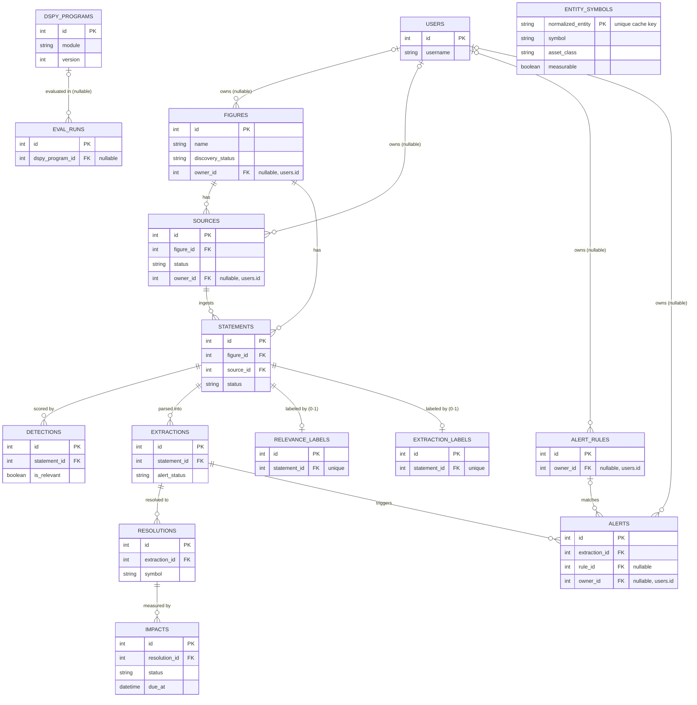

# Bellwether Data Model

Source of truth: `src/bellwether/models/*.py` (SQLAlchemy 2.0 declarative models). This
document is generated by reading those files directly — every column and FK below is
verified against the model code, not assumed.

## 1. Entity-relationship diagram



**Note on `entity_symbols`:** it is a standalone lookup/cache table (populated by the
resolve worker, keyed on `normalized_entity`). There is **no declared foreign key**
between `resolutions`/`extractions` and `entity_symbols` — the resolve stage looks it up
by string match on the normalized entity name (`worker.py::_cached_outcome`), not by a
DB-enforced relationship. It is shown above with no relationship edges for that reason.

**Deviation from the naive "1:1" assumption:** `resolutions.extraction_id` has **no
unique constraint** (only `index=True`) — so the schema allows an extraction to resolve
to zero-or-many `resolutions` (one row per entity mentioned in the extraction, per
`worker.py::make_resolve_stage`, which loops `for entity in entities` and inserts one
`Resolution` per entity). It is not a DB-enforced 1:1. The diagram reflects this as
`EXTRACTIONS ||--o{ RESOLUTIONS`.

`relevance_labels` and `extraction_labels` key on **`statement_id`** (each `unique=True`,
`nullable=False`), not `extraction_id` — verified directly in
`src/bellwether/models/relevance_label.py` and `extraction_label.py`. This matches the
eval/training use case: labels are gold judgments about a *statement* (is it relevant?
what would a correct extraction look like?), independent of whatever an LLM extraction
run happened to produce.

## 2. Per-table reference

### Corpus (shared)

Facts about the world — figures, what they said, what was extracted from it, and how
markets moved afterward. All corpus tables carry a nullable `owner_id` (except
`detections`, `extractions`, `resolutions`, `impacts`, `entity_symbols`, `relevance_labels`,
`extraction_labels`, `eval_runs`, `dspy_programs`, which have none) reserved for future
multi-user partitioning; today the app runs single-tenant and `owner_id` is set from the
owning figure where applicable.

| Table | Purpose | Key columns |
|---|---|---|
| **figures** | A tracked public figure (person/org) whose statements are ingested. | `name`, `type`, `aliases` (JSONB), `wikidata_id`, `discovery_status` (`pending`/`running`/`done`/`failed`/`skipped`), `discovery_claimed_at`, `discovery_error`, `owner_id` (nullable FK → `users.id`) |
| **sources** | A connector instance (RSS/X/etc.) that feeds statements for a figure. | `figure_id` (FK, `ON DELETE CASCADE`), `connector_type`, `config` (JSONB), `provenance` (`primary`/...), `origin` (`manual`/`discovered`), `enabled`, `poll_interval_seconds`, `last_polled_at`, `status` (`active`/`pending_review`/`rejected`), `verified`, `discovery_confidence`, `discovery_meta` (JSONB), `owner_id` (nullable FK → `users.id`) |
| **statements** | A single ingested item of text (post/transcript/etc.) from a source. | `figure_id` (FK), `source_id` (FK, `ON DELETE CASCADE`), `external_id` (unique with `source_id`), `text`, `url`, `provenance`, `published_at`, `ingested_at`, `status` (pipeline state — see §3), `claimed_at` (worker lease) |
| **detections** | Relevance-classifier verdict for a statement (is it market-relevant?). | `statement_id` (FK, `ON DELETE CASCADE`), `is_relevant`, `score`, `model`, `version` |
| **extractions** | Structured (entity, direction, magnitude) parse of a relevant statement. | `statement_id` (FK, `ON DELETE CASCADE`), `entities` (JSONB), `direction`, `magnitude`, `confidence`, `evidence_quote`, `model`, `version`, `alert_status` (`pending`/`alerting`/`done`), `alert_claimed_at` |
| **resolutions** | One extracted entity resolved to a tradable symbol (or "not measurable"). | `extraction_id` (FK, `ON DELETE CASCADE`, **not unique** — one extraction can yield many resolutions, one per entity), `entity`, `symbol`, `asset_class`, `measurable` |
| **entity_symbols** | Cache of entity-name → symbol resolutions, keyed by normalized name (avoids re-querying the LLM resolver for repeat entities). No FK to other tables — matched by string. | `normalized_entity` (unique), `symbol`, `asset_class`, `measurable`, `instrument_name`, `confidence`, `source` (`llm`/...) |
| **impacts** | A price-move measurement for one resolution over one time window (e.g. `1d`). | `resolution_id` (FK, `ON DELETE CASCADE`; unique with `window`), `symbol`, `asset_class`, `window`, `event_at`, `due_at` (measurement queue key), `status` (`pending`/`measuring`/`measured`/`measure_failed`), `price_t0`, `price_after`, `pct_move`, `volume_spike`, `measured_at`, `claimed_at` |
| **relevance_labels** | Gold/human label for whether a statement is relevant (eval + DSPy training). | `statement_id` (FK, `ON DELETE CASCADE`, **unique**), `is_relevant`, `source` (`review`/...), `split` (train/dev/test) |
| **extraction_labels** | Gold/human label for the correct extraction of a statement. | `statement_id` (FK, `ON DELETE CASCADE`, **unique**), `entities` (JSONB), `direction`, `magnitude`, `evidence_quote`, `source` (`review`/...), `split` |
| **eval_runs** | Recorded score of a module (detect/extract/resolve) on a labeled split. | `module`, `dspy_program_id` (nullable FK → `dspy_programs.id`, `ON DELETE SET NULL`), `split`, `metric`, `score`, `n` |
| **dspy_programs** | A compiled/optimized DSPy program artifact for a module, with its holdout score. | `module` (unique with `version`), `version`, `artifact` (JSONB), `holdout_score`, `is_champion` |

### Per-user

Owner-scoped configuration and delivery records — not shared facts about the world.

| Table | Purpose | Key columns |
|---|---|---|
| **users** | Application account. | `username` (unique), `hashed_password`, `is_active` |
| **alert_rules** | A user-defined condition for firing an alert on new extractions. | `owner_id` (nullable FK → `users.id`), `name`, `condition` (JSONB), `webhook_url`, `enabled` |
| **alerts** | A fired alert instance for one extraction matching one rule. | `extraction_id` (FK, `ON DELETE CASCADE`; unique with `rule_id`), `rule_id` (nullable FK → `alert_rules.id`, `ON DELETE SET NULL`), `owner_id` (nullable FK → `users.id`), `payload` (JSONB), `webhook_status` (`pending`/`sent`/`failed`/`skipped`), `sent_at` |

## 3. Lifecycles

All four flows follow the same claim/reclaim pattern (`src/bellwether/queue.py`,
`src/bellwether/worker.py`): a worker atomically claims the oldest eligible row with
`SELECT ... FOR UPDATE SKIP LOCKED`, flips it to an in-flight status and stamps a
`claimed_at`, commits immediately (releasing the row lock before any slow LLM/network
call), does the work, then commits the terminal status with `claimed_at` cleared. A
periodic reclaim sweep resets rows stuck in an in-flight status past a staleness cutoff
back to their pre-claim status, so a crashed worker never strands a row.

1. **Statement pipeline — `statements.status`**

   ```
   new --detect--> detected --extract--> extracted --resolve--> resolved
    |                  |                     |
    +--> irrelevant     +--> extract_failed  (terminal on either failure branch)
   ```

   In-flight (claimed) statuses: `detecting`, `extracting`, `resolving` — each reclaimed
   back to its pre-claim status (`new`, `detected`, `extracted` respectively) if stale.

2. **Impact due-queue — `impacts.status` + `due_at`**

   ```
   pending --(due_at <= now, claim)--> measuring --> measured
                                            |
                                            +--> measure_failed (terminal — insufficient data)
   ```

   `due_at` is the queue key: `claim_due_impact` only claims rows whose window has
   actually elapsed (`event_at + window`), not just the oldest pending row.

3. **Discovery — `figures.discovery_status`**

   ```
   pending --claim--> running --> done
                          |
                          +--> failed
   ```

   `skipped` is a non-worker terminal state set at figure creation when discovery is
   disabled (`repositories/watchlist.py`). Discovered `sources` additionally carry their
   own human-in-the-loop status: `pending_review` → `active` (confirmed) or `rejected`
   (a human decision is never overwritten by a re-run of discovery).

4. **Alerting — `extractions.alert_status`**

   ```
   pending --claim--> alerting --> done
   ```

   `done` is reached regardless of whether any `alerts` rows were actually created —
   it marks that the extraction was evaluated against all `alert_rules`, not that an
   alert fired. Whether a webhook delivery succeeded is tracked separately on each
   `alerts` row via `webhook_status` (`pending`/`sent`/`skipped`/`failed`).

**Shared-corpus vs owner-scoped:** the corpus tables (`figures` ... `dspy_programs`)
represent facts about the world (what was said, extracted, resolved, measured) and are
visible across the whole app; the nullable `owner_id` present on `figures`, `sources`,
`alert_rules`, and `alerts` is reserved for a future multi-user mode where a user's
private watchlist/rules layer over the shared corpus, rather than partitioning the facts
themselves. `alert_rules` and `alerts` are the genuinely owner-scoped tables today —
delivery configuration and delivery records belong to a specific user, not the corpus.
