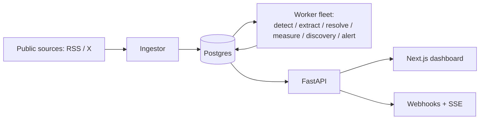

# bellwether — Project Documentation Implementation Plan

> **For agentic workers:** REQUIRED SUB-SKILL: Use superpowers:subagent-driven-development (recommended) or superpowers:executing-plans to implement this plan task-by-task. Steps use checkbox (`- [ ]`) syntax for tracking.

**Goal:** Reader-facing documentation (six files) that lets anyone understand + run + extend bellwether — layered from a general pitch to concrete developer/agent detail, with Mermaid diagrams, every fact verified against the code.

**Architecture:** `README.md` + `AGENTS.md` (+ `CLAUDE.md` pointer) at root; `docs/ARCHITECTURE.md`, `docs/DATA-MODEL.md`, `docs/DEVELOPING.md`. API self-documented via OpenAPI (no hand `API.md`). Each doc has one job; the human "run/extend" doc and the agent "rules" doc are separate. Design spec: `docs/superpowers/specs/2026-07-08-bellwether-documentation-design.md`.

**Tech Stack:** Markdown + Mermaid (GitHub-rendered). No code changes.

## Global Constraints (VERIFIED GROUND-TRUTH — use these exact values)

- **15 tables:** `figures`, `sources`, `statements`, `detections`, `extractions`, `resolutions`, `entity_symbols`, `impacts`, `relevance_labels`, `extraction_labels`, `eval_runs`, `dspy_programs`, `users`, `alert_rules`, `alerts`. (Shared-corpus = all except `users`/`alert_rules`/`alerts` which carry a user relationship; `alert_rules`/`alerts` are owner-scoped; most others carry a nullable `owner_id` for future multi-user.)
- **Worker CLI stages:** `python -m bellwether.worker {detect|extract|resolve|measure|discovery|alert}`.
- **Optimize CLI:** `python -m bellwether.optimize {run|programs|promote|evals}`.
- **18 API paths** (self-documented at `/docs` + `/openapi.json`): auth `POST /auth/token`, `GET /me`; watchlist `GET/POST /figures`, `DELETE /figures/{id}`, `POST /figures/{id}/discover`, `GET/POST /figures/{id}/sources`, `PATCH/DELETE /sources/{id}`; statements `GET /statements`; discovery `GET /discovery/queue`, `POST /discovery/{source_id}`; review `GET /review/queue`, `POST /review/{statement_id}`; feed `GET /signals`, `GET /impacts`, `GET /leaderboard`; alerts `GET/POST /alert_rules`, `PATCH/DELETE /alert_rules/{rule_id}`; SSE `GET /stream`.
- **Queue claim columns (independent):** `statements.status` (+`claimed_at`), `impacts.due_at` (+`status`/`claimed_at`), `figures.discovery_status` (+`discovery_claimed_at`), `extractions.alert_status` (+`alert_claimed_at`).
- **Connectors:** `rss` (built), `x` (built, disabled without `X_API_KEY`).
- **Settings env vars** (subset that matters for docs): `DATABASE_URL`, `JWT_SECRET`, `ADMIN_USERNAME/PASSWORD`, `CORS_ORIGINS`, model strings (`detect_model`/`extract_model`/`resolve_model`/`discovery_model`/`reflection_model`), thresholds (`relevance_threshold`/`resolve_confidence_threshold`/`discovery_confidence_threshold`/`holdout_modulus`), `measure_windows`. Credentials are plain env, never Settings: `ANTHROPIC_API_KEY`/other provider keys, `TAVILY_API_KEY`, `X_API_KEY`, and `LITELLM_LOCAL_MODEL_COST_MAP=True`.
- **Env quirks:** `.venv/bin/python` (shell python is shadowed); `docker compose up db` for Postgres; `.env` git-ignored (real secrets — back up before overwriting).
- **Every diagram is Mermaid** in a ```` ```mermaid ```` fence; keep node labels short; sanity-check each parses (simplify rather than ship a broken block).
- **No code changes.** Docs + the one-line `CLAUDE.md` only. Verify every fact against the repo — do not assert from memory.

## File Structure

```
/
├── README.md                 # (rewrite the empty stub)
├── AGENTS.md                 # (new)
├── CLAUDE.md                 # (new — one-line pointer)
├── README-docker.md          # (exists — linked, not rewritten)
└── docs/
    ├── ARCHITECTURE.md       # (new)
    ├── DATA-MODEL.md         # (new)
    └── DEVELOPING.md         # (new)
```

---

### Task 1: README.md (the layered front door)

**Files:** Rewrite `README.md`.

**Interfaces:** Produces the front door linking to `docs/ARCHITECTURE.md`, `docs/DATA-MODEL.md`, `docs/DEVELOPING.md`, `AGENTS.md`, `README-docker.md` (those are created in later tasks — links are forward references, fine for a docs branch merged as a whole).

- [ ] **Step 1: Write `README.md`** with these sections (spec §3), using the verified ground-truth from Global Constraints:

1. `# bellwether` + one-line pitch: "A single-user research system that ingests public statements of high-influence figures, extracts structured market signals with LLMs (DSPy), and measures their real market impact."
2. **What & why** — 1 short paragraph: the problem (which figures actually move markets, and did a given statement?), and the hard boundaries: **read-only, provenance-guarded, no trading / no content generation / no execution.**
3. **System diagram** — a Mermaid `flowchart LR`:

4. **Feature tour** — bullets: the pipeline (detect market-relevance → extract a structured signal → resolve the entity to a market symbol → measure the price move via an event study); source discovery (Wikidata + LLM); the evaluation/optimization flywheel (golden labels → GEPA-optimized prompts → champion/challenger) with the market-accuracy firewall; alerts (per-rule webhooks + a live SSE feed); the dashboard.
5. **Quickstart (Docker)** — fenced:
```bash
cp .env.docker.example .env      # edit JWT_SECRET / ADMIN_PASSWORD
docker compose up --build        # Postgres + migrations + API (:8000) + 6 workers + frontend (:3000)
# open http://localhost:3000
```
Then: "For host development (venv, running individual pieces), see **[docs/DEVELOPING.md](docs/DEVELOPING.md)**."
6. **Surface at a glance** — a compact endpoint table (group the 18 paths from Global Constraints), plus: "The REST API is self-documented — run the API and open **`/docs`** (Swagger) or fetch **`/openapi.json`**." + the worker CLI (`python -m bellwether.worker <stage>`, the 6 stages) + the optimize CLI (`python -m bellwether.optimize {run|programs|promote|evals}`).
7. **Project layout** — an annotated tree of `src/bellwether/` (api, worker.py, queue.py, models, connectors, ingest.py, llm, market, measure, resolutions via resolve, eval, trackb, optimize.py, programs.py, discovery, alerts, security, config.py) + `frontend/` + `docs/`.
8. **Status & how it was built** — "Complete: Plans 1–7b + Dockerized." 2–3 lines: built as a 7-plan sequence, each plan spec-driven → TDD → per-task + whole-branch code review → live end-to-end verification (specs/plans in `docs/superpowers/`).
9. **Documentation** — a links list: Architecture → `docs/ARCHITECTURE.md`; Data model → `docs/DATA-MODEL.md`; Developing → `docs/DEVELOPING.md`; For AI agents → `AGENTS.md`; Docker → `README-docker.md`.

- [ ] **Step 2: Verify the Mermaid + facts**

Run: `grep -c '```mermaid' README.md` (≥1). Confirm the endpoint table matches the 18 paths in Global Constraints; the CLI stages match; the layout tree matches `ls src/bellwether/`. Fix any mismatch.

- [ ] **Step 3: Commit**

```bash
git add README.md
git commit -m "docs: README front door (pitch, system diagram, quickstart, surface, layout)"
```

---

### Task 2: AGENTS.md + CLAUDE.md (agent contract)

**Files:** Create `AGENTS.md`, `CLAUDE.md`.

**Interfaces:** `CLAUDE.md` is a one-line pointer to `AGENTS.md`. `AGENTS.md` links `README.md`/`docs/ARCHITECTURE.md`/`docs/DEVELOPING.md`.

- [ ] **Step 1: Write `AGENTS.md`** (spec §4), terse + rule-shaped:

1. **Orientation** — 1 line ("bellwether — LLM-driven market-signal research pipeline; see [README](README.md) and [docs/ARCHITECTURE.md](docs/ARCHITECTURE.md)").
2. **How work is done here** — spec → plan → subagent-driven TDD → per-task + whole-branch review → **live/e2e verification** before merge; specs + plans live in `docs/superpowers/`; never execute a plan unapproved/unmerged.
3. **Environment landmines** —
   - `.venv/bin/python -m pytest …` / `.venv/bin/alembic …` — the shell `python`/`pytest` are a shadowing MacPorts 3.12; bare invocations use the wrong interpreter.
   - Postgres: `docker compose up db` (or the full stack). Tests hit a **real** Postgres.
   - **`LITELLM_LOCAL_MODEL_COST_MAP=True`** for anything importing dspy (litellm fetches its cost-map on import and hangs under load). It's set in `tests/conftest.py`; set it for ad-hoc scripts/gen steps too.
   - `.env` is git-ignored and holds **real secrets** — if a task must overwrite it (e.g. swap in `.env.docker.example`), back it up first and restore it; never commit a real `.env`.
4. **Test rules** — real Postgres (no mocking); `owner_id=None` in tests that don't test ownership (else FK violations); do **not** modify `tests/conftest.py` / `tests/api/conftest.py`; API write endpoints + external adapters (LLM, market, webhook, Wikidata) are stubbed in the suite → **verify them live before merge** ("stubs hide integration bugs").
5. **Invariants you must not break** —
   - **Firewall:** `bellwether.eval.*` must never import `Impact`/`Resolution`; a Track-A accuracy score is invariant to market data (enforced by a test).
   - **`worker.py` stays clean:** no DSPy/market/Wikidata/webhook imports at module top; the `build_*()` factories are imported function-locally in `_build_stage`.
   - **Discovery:** "the LLM proposes, deterministic verification disposes" — an LLM/Tavily-proposed source can never auto-enable itself; only cross-referenced authorities clear the confidence gate.
   - **Provider-agnostic:** model names are `Settings` strings; credentials are plain env vars (never `Settings` fields).
   - **Anti-fabrication:** an extraction's (and a corrected gold) `evidence_quote` must be a verbatim substring of the statement (`is_verbatim`).
   - **Idempotent queues:** claim-then-commit-before-slow-work; unique constraints guard re-fires.
6. **Where things live / run the suite** — `src/bellwether/` layout one-liner; `.venv/bin/python -m pytest -q` (full suite, real Postgres); the worker/optimize CLIs. For run/extend mechanics → [docs/DEVELOPING.md](docs/DEVELOPING.md).

- [ ] **Step 2: Write `CLAUDE.md`**

```markdown
See [AGENTS.md](AGENTS.md) for how to work in this repo (conventions, environment, invariants).
```

- [ ] **Step 3: Commit**

```bash
git add AGENTS.md CLAUDE.md
git commit -m "docs: AGENTS.md agent contract + CLAUDE.md pointer"
```

---

### Task 3: docs/ARCHITECTURE.md (technical deep-dive)

**Files:** Create `docs/ARCHITECTURE.md`.

- [ ] **Step 1: Write `docs/ARCHITECTURE.md`** (spec §5). Sections:

1. **Overview** — the flow in prose + a Mermaid component graph (API, the worker fleet, Postgres, and the adapter seams: LLM via DSPy/LiteLLM, market via yfinance, discovery via Wikidata/Tavily, notifier via webhooks).
2. **The pipeline, stage by stage** — Ingest → Detect → Extract → Resolve → Measure. For each: **consumes / writes / logic / errors (terminal vs retryable)**. Include a Mermaid `stateDiagram-v2` of `statements.status` (`new → detecting → detected/irrelevant → extracting → extracted/extract_failed → resolved → …`; verify the exact status strings against `worker.py` before finalizing).
3. **Worker & queue model** — the generic `Stage(name, claim_next, reclaim, process)`; `FOR UPDATE SKIP LOCKED`; **claim-then-commit before slow work**; graceful shutdown + periodic reclaim; the CLI; the **four independent claim columns** (`statements.status`, `impacts.due_at`, `figures.discovery_status`, `extractions.alert_status`) so the stages don't contend.
4. **The seams** — frozen `Detector`/`Extractor`/`Resolver`/`Discoverer` contracts + `build_*()` factories (the swap-a-paradigm boundary; `worker.py` stays paradigm-free); the champion-loading seam (`build_*` loads the optimized program + stamps its `version`); provider-agnostic DSPy/LiteLLM; the market/discovery/notifier adapter registries.
5. **Evaluation & the firewall** — **Track A** (review-and-correct → golden `relevance_labels`/`extraction_labels` with a train/held-out split → GEPA optimize → champion/challenger over versioned `dspy_programs`, promoted only on a strictly-better held-out score) vs **Track B** (market-impact reporting: the per-figure leaderboard). The **firewall**: Track-A scoring reads only labels + model output, never market data — enforced by an invariance test.
6. **Source discovery** — the `discovery` worker: Wikidata backbone (P856/P2002/P2397 + aliases) + a DSPy Discovery module (disambiguation + Tavily gap-fill) → the deterministic **confidence gate** (additive signals, threshold) → auto-enable vs `pending_review` → the review queue.
7. **Alerts** — the decoupled `alert` stage: evaluate the figure-owner's rules against each new extraction → write `alerts` → dispatch to per-rule webhooks; the SSE `/stream` DB-polls `alerts` (so webhook + feed work across the worker/API process split).
8. **Cross-cutting invariants** — read-only/provenance, the verbatim guard, owner-scoping, idempotency, and "verify live — stubs hide integration bugs" (the SSL-CA, fetch-window, and swallowed-error bugs that only live runs caught).

- [ ] **Step 2: Verify statuses + Mermaid**

Confirm the `statements.status` values in the state diagram against `grep -o 'status = "[a-z_]*"' src/bellwether/worker.py` (use the real strings). `grep -c '```mermaid' docs/ARCHITECTURE.md` ≥ 2. Fix mismatches.

- [ ] **Step 3: Commit**

```bash
git add docs/ARCHITECTURE.md
git commit -m "docs: ARCHITECTURE.md (pipeline, queue model, seams, firewall, discovery, alerts)"
```

---

### Task 4: docs/DATA-MODEL.md

**Files:** Create `docs/DATA-MODEL.md`.

- [ ] **Step 1: Write `docs/DATA-MODEL.md`** (spec §6):

1. **ER diagram** — a Mermaid `erDiagram` of the 15 tables + the key FKs (figure 1..* source; figure 1..* statement; statement 1..* extraction; extraction 1..1 resolution; resolution 1..* impact; extraction 1..1 relevance_label/extraction_label; extraction 1..* alert; alert_rule 1..* alert; user 1..* figure/alert_rule). Keep it readable — the load-bearing relationships, not every column. Verify FK columns against `src/bellwether/models/*.py`.
2. **Per-table reference** — grouped **Corpus (shared)**: figures, sources, statements, detections, extractions, resolutions, entity_symbols, impacts, relevance_labels, extraction_labels, eval_runs, dspy_programs — and **Per-user**: users, alert_rules, alerts. For each: one-line purpose + the key columns (especially the status/lifecycle ones). Pull column names from the model files; don't invent.
3. **Lifecycles** — the four status flows: statement pipeline (`statements.status`), impact due-queue (`impacts.status` + `due_at`), discovery (`figures.discovery_status`), alerting (`extractions.alert_status`). Note shared-corpus (facts, nullable `owner_id` for future multi-user) vs owner-scoped (`alert_rules`/`alerts`).

- [ ] **Step 2: Verify tables + Mermaid**

Confirm the 15 table names match `grep -rh "__tablename__" src/bellwether/models/`. `grep -c '```mermaid' docs/DATA-MODEL.md` ≥ 1 and the `erDiagram` references only real tables. Fix mismatches.

- [ ] **Step 3: Commit**

```bash
git add docs/DATA-MODEL.md
git commit -m "docs: DATA-MODEL.md (ER diagram, per-table reference, lifecycles)"
```

---

### Task 5: docs/DEVELOPING.md

**Files:** Create `docs/DEVELOPING.md`.

- [ ] **Step 1: Write `docs/DEVELOPING.md`** (spec §7):

1. **Setup** — `.venv/bin/python` (note the shadowing); `docker compose up -d db` (Postgres on localhost:5432, user/pw/db `bellwether`); `cp .env.example .env`; `.venv/bin/alembic upgrade head`.
2. **Run the pieces** — API: `.venv/bin/python -m uvicorn bellwether.api.app:create_app --factory --port 8000` (Swagger at `/docs`); the six workers: `.venv/bin/python -m bellwether.worker <stage>` (list all 6); optimize: `.venv/bin/python -m bellwether.optimize run extract`; frontend: `cd frontend && npm run dev` (+ add `http://localhost:3000` to `CORS_ORIGINS` in `.env`).
3. **Tests** — `.venv/bin/python -m pytest -q` (real Postgres; `conftest` sets `LITELLM_LOCAL_MODEL_COST_MAP`); conventions: `owner_id=None` in non-ownership tests; write endpoints/adapters are stubbed → verify live before shipping.
4. **Extending** — three concrete recipes pointing at the seams: **add a connector** (implement `SourceConnector.fetch()`, register in `connectors/registry.py`); **add a worker stage** (a `make_*_stage` + a claim column + wire `_build_stage` + the CLI `choices`); **optimize a module** (`bellwether.optimize run <module>` — needs golden labels via the review API).
5. **Docker** — 2 lines + link to `README-docker.md`.

- [ ] **Step 2: Verify commands**

Confirm the run commands match reality: the uvicorn factory (`create_app`), the 6 worker stages, the optimize subcommands, `npm run dev` (frontend `package.json`). No Mermaid required here.

- [ ] **Step 3: Commit**

```bash
git add docs/DEVELOPING.md
git commit -m "docs: DEVELOPING.md (setup, run, test, extend)"
```

---

### Task 6: Accuracy pass + link check

**Files:** touch-ups across the six docs as needed.

- [ ] **Step 1: Render/parse check the Mermaid**

For each doc with Mermaid, confirm the fences are well-formed (balanced ```` ``` ````, `mermaid` tag). If `npx` is available and quick, `npx -y @mermaid-js/mermaid-cli -i README.md` style validation is a bonus — but do NOT block on installing it; a careful manual parse of each block (valid node/edge syntax, no stray characters) suffices. Simplify any block that looks fragile.

- [ ] **Step 2: Cross-link check**

Every relative link resolves to a real file: README → docs/ARCHITECTURE.md, docs/DATA-MODEL.md, docs/DEVELOPING.md, AGENTS.md, README-docker.md; AGENTS.md/CLAUDE.md → their targets; docs/* back to README where referenced. Run: `grep -rhoE "\]\(([^)]+\.md)\)" *.md docs/*.md | sed -E 's/.*\(([^)]+)\)/\1/' | sort -u` and confirm each path exists.

- [ ] **Step 3: Fact spot-check**

Re-grep the ground-truth and diff against the docs: table list (`grep __tablename__`), worker stages, optimize subcommands, the 18 API paths (`/openapi.json`), env var names. Fix any drift.

- [ ] **Step 4: Fresh-eyes read + commit**

Read all six top-to-bottom for placeholders/contradictions/broken tone. Fix inline.
```bash
git add -A -- README.md AGENTS.md CLAUDE.md docs/ARCHITECTURE.md docs/DATA-MODEL.md docs/DEVELOPING.md
git commit -m "docs: accuracy pass — verify facts, Mermaid, and cross-links"
```

---

## Self-Review

**Spec coverage:** README (§3) — Task 1; AGENTS+CLAUDE (§4) — Task 2; ARCHITECTURE (§5) — Task 3; DATA-MODEL (§6) — Task 4; DEVELOPING (§7) — Task 5; verification (§8) — Task 6 + the per-task verify steps. Deferred (§9: API.md/CONTRIBUTING/screenshots/doc-tests) — no task, correct.

**Ground-truth is carried, not recalled:** the 15 tables, 18 API paths, 6 worker stages, 4 optimize subcommands, the queue claim columns, connectors, and env vars are listed verbatim in Global Constraints (each gathered from the repo: models, `/openapi.json`, `worker.py`, `optimize.py`, `config.py`). Every task's verify step re-greps its facts against the source.

**Deliberate flags:** (1) the exact `statements.status` strings for the ARCHITECTURE state diagram must be pulled from `worker.py` at write time (Task 3 Step 2) — the plan lists the shape, not guessed strings. (2) Mermaid validation is best-effort (manual parse; `mermaid-cli` only if `npx` is quick) — do not block on a renderer. (3) Forward links between docs are fine because the branch merges as a unit.

**Consistency:** the six files + their responsibilities match the spec §1 exactly (human DEVELOPING vs agent AGENTS kept distinct); Mermaid used in README/ARCHITECTURE/DATA-MODEL; API pointed at OpenAPI in README + DEVELOPING (no hand API.md); `README-docker.md` linked, not duplicated. No code changes anywhere.
